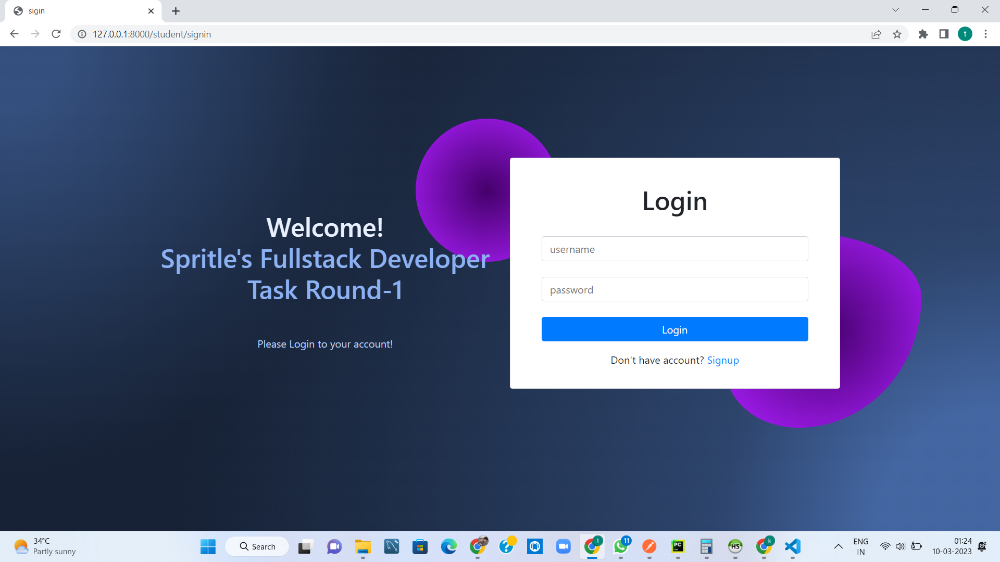

#   Spritle's Full Stack Application Task

##Round 1

    Scalable Django web application with master & student authentication, authorization & some mathematical operations

--> *Preview :*

## The Lomofy Diagram
 

  

--> *Full View:*

You can see clearly the diagram at :&nbsp; 

##Introduction

This is a web application for Student & master task execution. 
Master panel have signup, login, logout, dashboard, task creation, evaluation. Student panel have signup, login, logout, dashboard, task lists, Submit solutions, view results

## 📸 Screenshot

 

    🔎 View
 

### Home

 ### 💻 Master Signin

### ➡️Master Signup

### ⌛ Master Dashboard

 ### ➕ Create task
 

### Submitted Tasks

### Evaluated Tasks

 ### 👨🏻‍💻 Master Profile
 

 ### 💻 Student Signin

### ➡Student Signup

### ⌛ Student Dashboard

### 💻 tasks

### Submitted Tasks

### 🛒 Student Profile

### ✅ Dark Mode

## Table Of Contents:

- [💻 Application Overview](static/docs/application-overview.md)
- [⚙   Project Configuration](static/docs/project-configuration.md)
- [📚 Additional Resources](static/docs/additional-resources.md)

